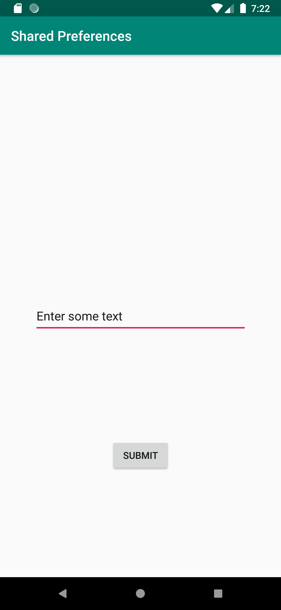
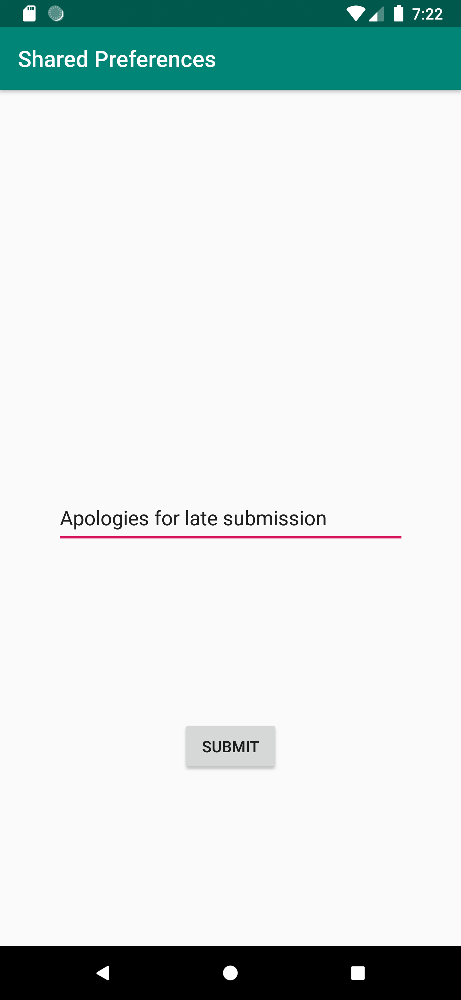
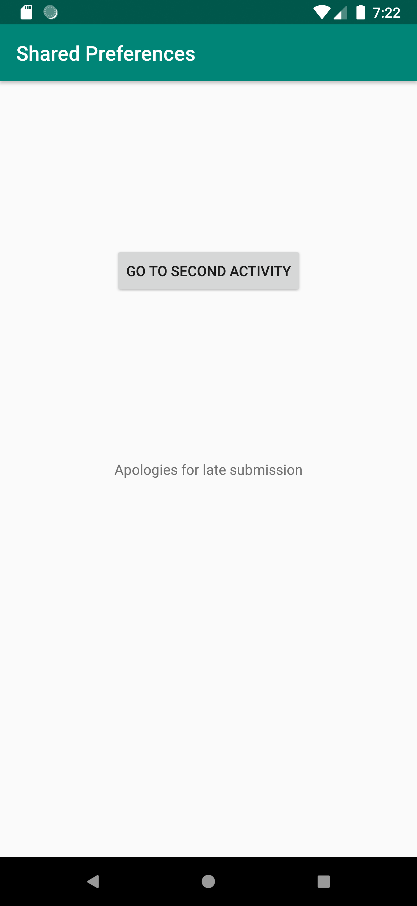

# Rapport

SharedPreferences skapas i MainActivity för att kunna dela data. Den instansieras i OnCreate() metoden.
SecondActivity skapas för att kunna öppna en ny skärm, samt den knapp för detta.

I SecondActivity behöver text från EditText kunna sparas för att kunna dela det med MainActivity.
Detta implementeras genom att spara det innehåll i EditText som en string för att sedan skicka in
det i filen MyPreferenceRef. Vilket gör att det är tillgängligt i MainActivity.
Koden ser ut som följande:

```
EditText editText = findViewById(R.id.editText);
String text = editText.getText().toString();

SharedPreferences sharedPreferences = getSharedPreferences("myPreferenceRef", MODE_PRIVATE);
SharedPreferences.Editor editor = sharedPreferences.edit();
editor.putString("MyAppPreferenceString", text);
editor.apply();
```

Stringen är nu tillgänglig i MainActivity när filen öppnas.

```
private SharedPreferences myPreferenceRef;
myPreferenceRef = getSharedPreferences("myPreferenceRef", MODE_PRIVATE);
```

TextView ersätts med att använda den rätta nyckeln för stringen, samt ändra texten.

```
TextView textView = findViewById(R.id.textView);
textView.setText(myPreferenceRef.getString("MyAppPreferenceString", ""));
```





